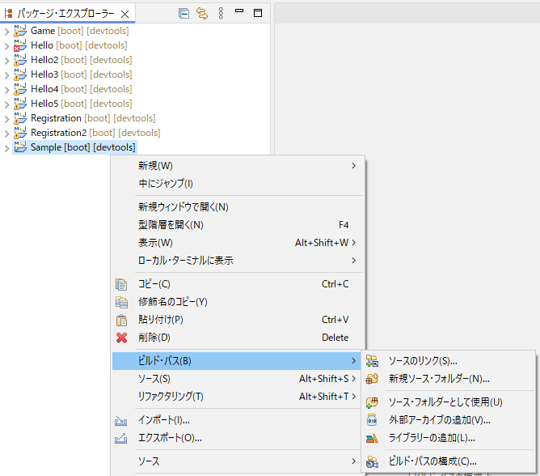
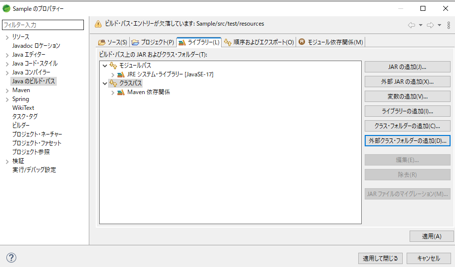

# クラスパス

## クラスパスとは
- Javaアプリケーションの実行に使用される。
- クラスパスには実行に必要なすべてのJavaクラスとライブラリが含まれる。

> ビルドパスは違うの？
> - ビルドパスはプロジェクトのビルドを行う（依存関係を見つける）際にコンパイル時に使用されるパス。クラスパスはコンパイルされたクラスの実行時に使う。

## クラスパス追加方法
mvn、java起動コマンドや、mavenのpomにclasspathを追加すればよい気もするがが、単体テストの環境であればEclipse上で設定できる。
> mvnコマンド例 mvn spring-boot:run -Dspring-boot.run.folders=[パス]

- 対象プロジェクト右クリ⇒ビルドパス→ビルドパスの構成
ビルドパス（大嘘

- ライブラリ⇒クラスパス→クラスフォルダor外部クラスフォルダの追加
