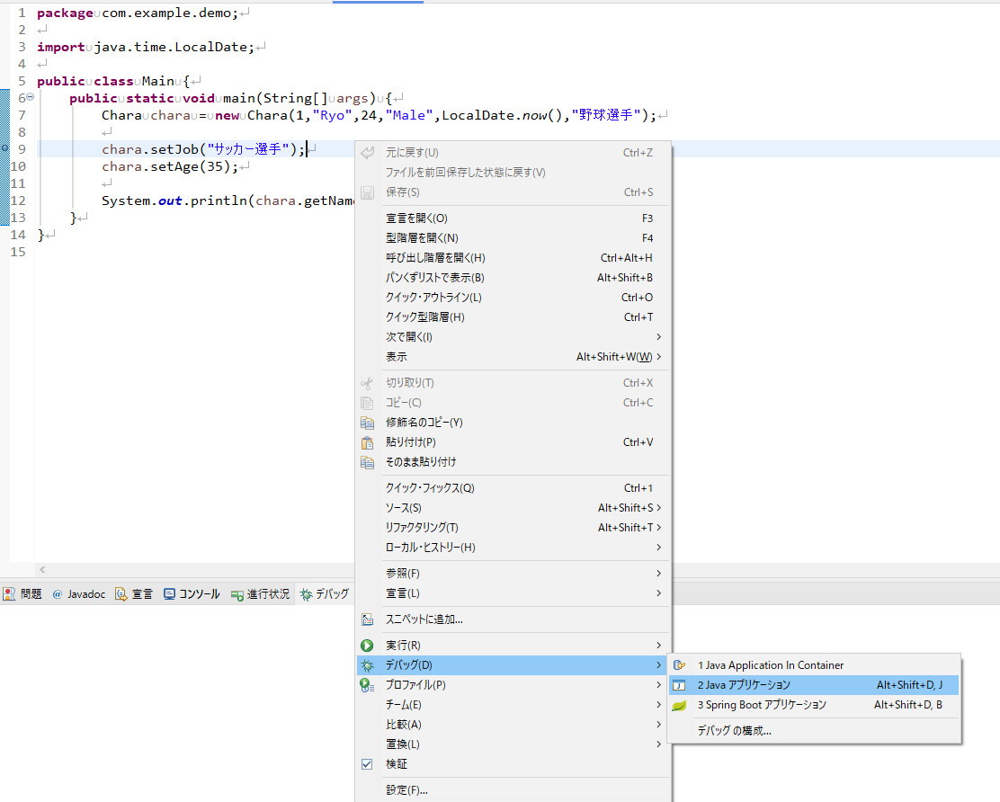
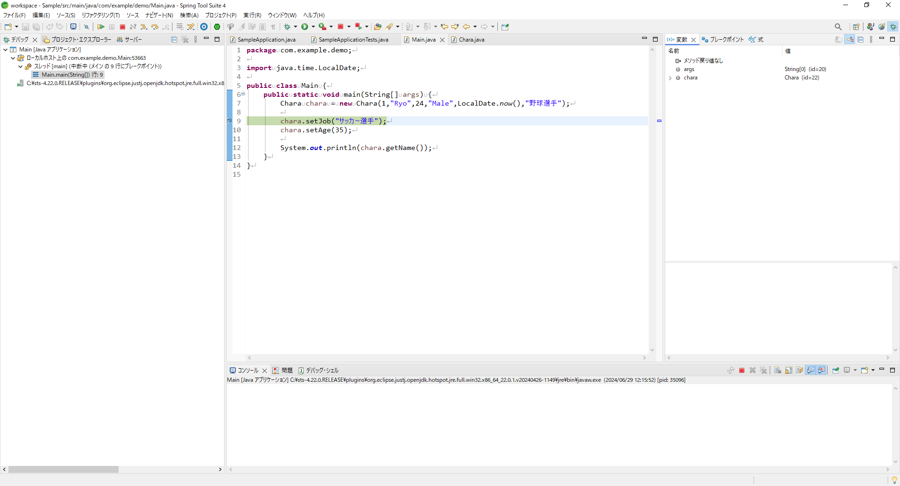

# デバッグ

## デバッグとは
- 作成したプログラムが想定通りの動きをしていないときに原因を探し出して直すこと。
> ここの処理がこう動くよね。ということを確認できるので、自分の作成したプログラムだけでなく、依存するモジュールの挙動を確認する際にも使え、勉強になる。

## デバッガ
- 原因調査のために利用するツール
- デバッガはブレークポイントなどで、プログラムを一時停止し、その時点の変数などの値を見たり、一行ずつ動かしてどの段階で想定と違う動きになっているかの調査を行う。

## 実際にやってみる
- EclipseではJavaファイルを開いて画面左の行番号のすぐ左部分をダブルクリックでブレークポイントを設定できる。

- この状態でデバッグ実行を行うと、ブレークポイントを設定した箇所で処理が一時停止される。

- デバッグのパースペクティブが開かれる。

- この一時停止中からは次のようなことができる。
    - 一時停止した状況での変数の値確認
        変数の値は画面右側の変数ビューから確認できる。
        
    - 一時停止した状況での実行したメソッドの実行結果確認
        式ビューに新しい式を追加し、メソッドを記述すれば、そのメソッドの実行結果が確認できる。
        
    - 処理の進行、または終了
      - 再開    F8
        - プログランの終了まで実行する。途中にブレークポイントがあれば、また一時停止する。
      - 終了    Ctrl+2
        - 処理を中断する。
      - ステップイン    F5
        - 次の行に進む。別メソッドをコールする場合、そのメソッドに入って一時停止する。
      - ステップオーバー    F6
        - 次の行に進む。別メソッドをコールする場合、そのメソッドの処理を行い、次の行に進む。
      - ステップリターン    F7
        - 実行中のメソッドのReturnまでを行い、呼び出し元のメソッドに戻った時点で一時停止する。